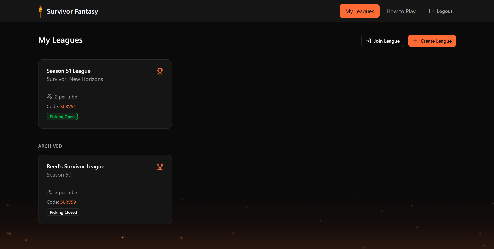
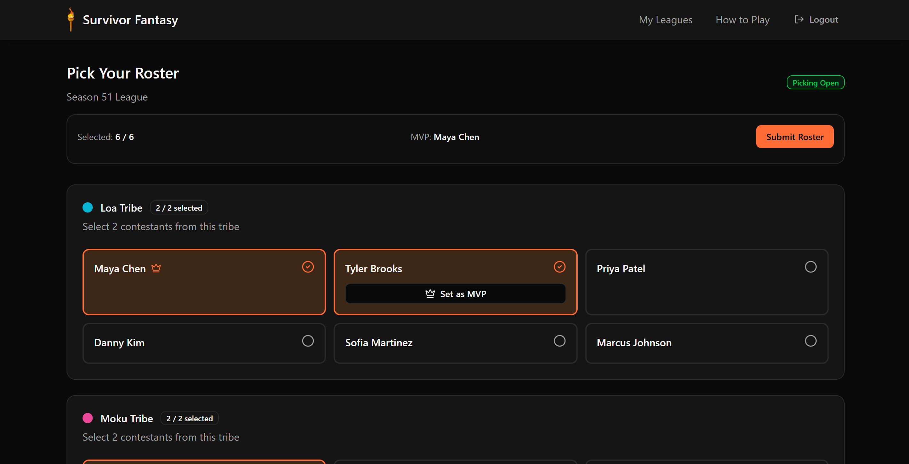
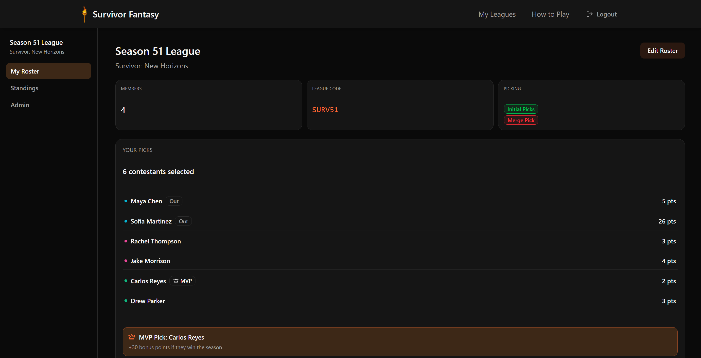
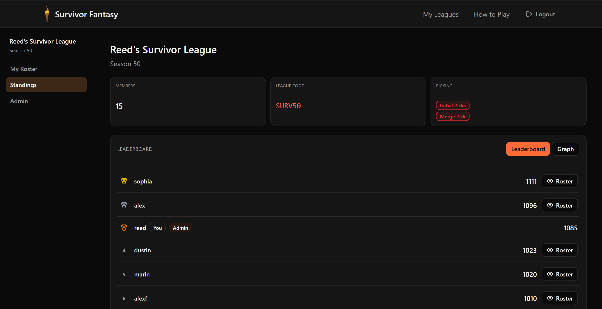
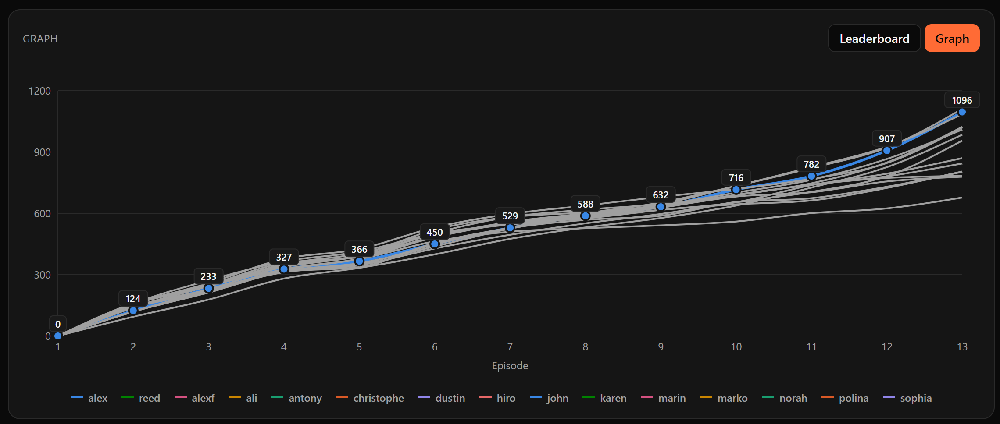
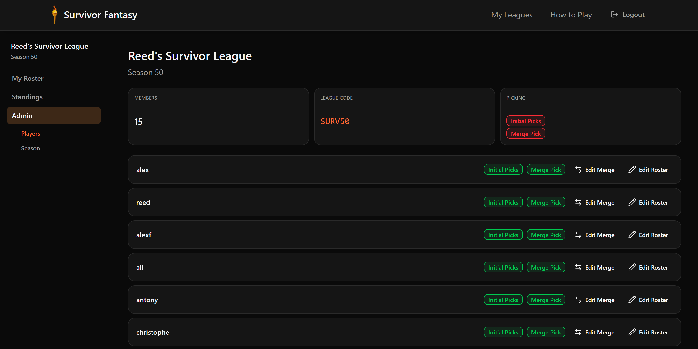
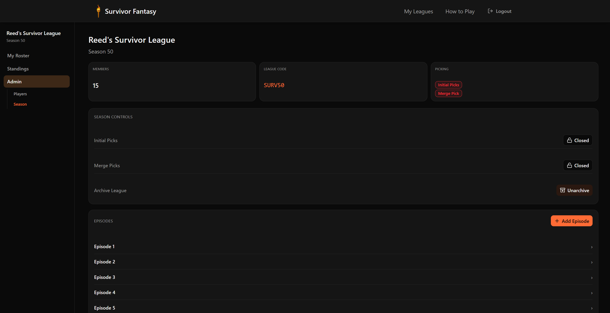

# Survivor Fantasy

A fantasy league app for CBS's *Survivor*. Create a league with your friends, draft a roster of castaways, and compete for the season by earning points as your picks survive, perform actions, and make it to the end.

**Live app:** [survivor-fantasy.app](https://survivor-fantasy.app/)

To register an account on the live app, you must have an invite code.

## How To Play

### Create an Account

### Leagues

Create a league for the current season or join one with an invite code.



### Draft Your Roster

When picking opens, draft contestants from each tribe up to the league's limit, then designate one pick as your **MVP** for bonus points if they win the season. Submit once your roster is complete.



### Track Your Team

Your roster page shows league info at a glance — member count, join code, and whether Initial Picks or Merge Pick is currently open — plus each of your contestants and the points they've earned so far. Eliminated contestants are flagged "Out" but hold onto the points they already scored.



### Standings

The leaderboard ranks every member of your league by total points, with medals for the top spots. Peek at anyone's roster to see who they drafted.




### Merge
After the merge, the commissioner opens the **Merge Pick** window for a second round of drafting. Add or swap one of your players at this point, if desired.

### Winning
Climb the **Standings** leaderboard — if your MVP wins the season, you earn a bonus on top of their regular points. Whoever has the most points at the end of the season wins.

## League Admin

League commissioners get an admin panel to manage the league:

- **Players** — see who has completed their Initial Picks and Merge Pick, and edit any member's roster on their behalf.

  

- **Season** — open or close the Initial Picks and Merge Pick drafting windows, and add episodes to score as the season airs.

  

## Tech Stack

- **Frontend:** React, TypeScript, Vite, Tailwind CSS, Radix UI
- **Backend:** Spring Boot (Java), Spring Security, Spring Session (JDBC), Spring Data JPA
- **Database:** MySQL, with Flyway for schema migrations
- **Deployment:** Docker Compose, Cloudflare Tunnel

## Running with Docker

Requires [Docker](https://docs.docker.com/get-docker/) and Docker Compose.

First copy the env template and fill in the secrets (`.env` is gitignored):

```bash
cp .env.example .env
```

**Development:**

```bash
docker compose up --build
```

This starts MySQL, runs Flyway migrations, and brings up the backend and frontend:

- Frontend: [http://localhost:3000](http://localhost:3000)
- Backend API: [http://localhost:8080](http://localhost:8080)

**Production** (adds a Cloudflare Tunnel, e.g. for a home server deployment):

```bash
TUNNEL_TOKEN=<your-cloudflare-tunnel-token> docker compose --profile production up -d --build
```
